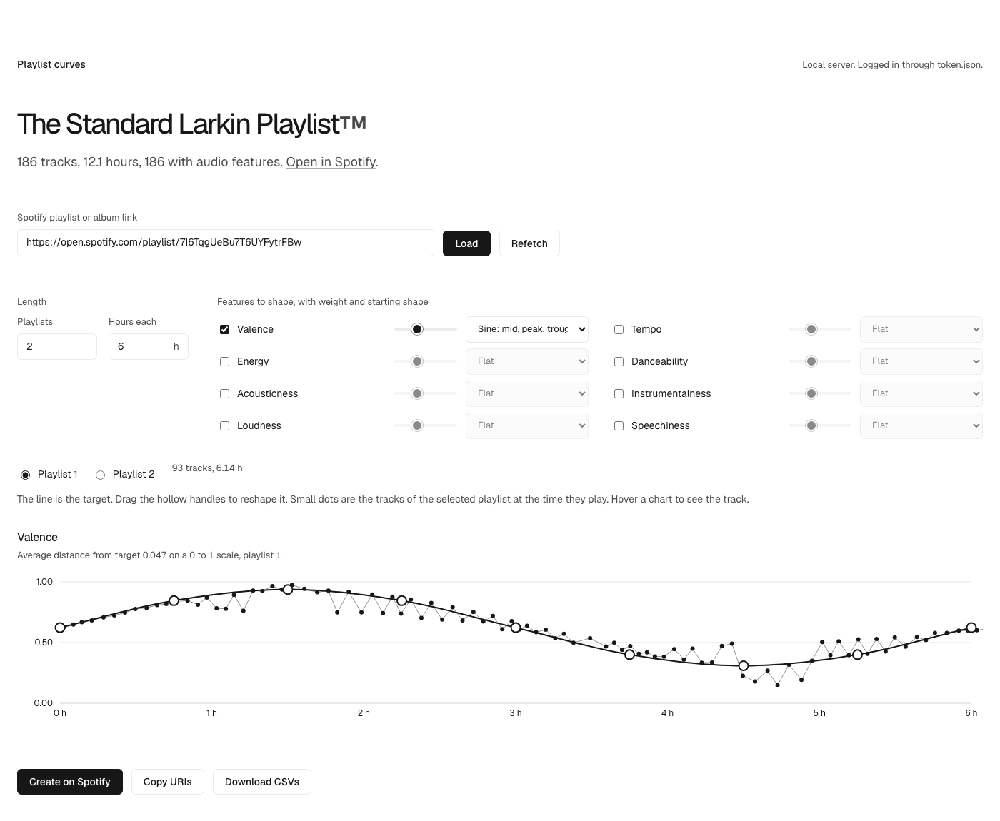
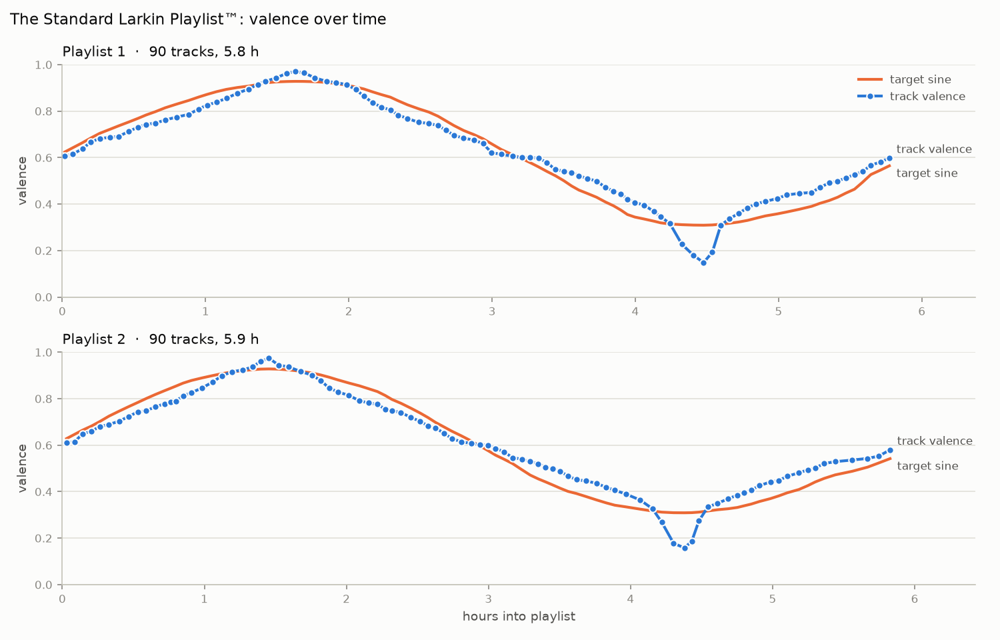

# Playlist curves

Reorder a Spotify playlist so its audio features follow a shape over time. Draw a sine
wave for valence, a slow rise in tempo, a hill in energy, then export the result as CSV,
Spotify URIs, or brand-new playlists on your account.



Paste any Spotify playlist or album link into the box at the top and it loads.

Two ways to use it:

- **Web editor** (`server.py` + `index.html`). One panel per feature, each with a
  draggable target curve. Every drag re-solves the track order live.
- **CLI** (`spotify_sine.py`). Valence-only sine wave, produces CSVs and a chart.



## How it works

1. Pulls every track in the source playlist through the Spotify Web API (PKCE login,
   no client secret).
2. Looks up audio features (valence, tempo, energy, danceability, acousticness,
   instrumentalness, loudness, speechiness) from [ReccoBeats](https://reccobeats.com),
   a mirror of Spotify's original feature data, because Spotify's own audio-features
   endpoint is deprecated and returns 403 for every app without approved extended quota.
   Tracks it can't match by ID are retried by title search.
   For anything still missing, **Estimate missing from audio** downloads the track's
   30-second preview, extracts descriptors with librosa, and predicts each feature with a
   model fitted on the tracks that do have values (`estimate_features.py`). Estimates are
   marked ≈ in the UI. They're rough: valence cross-validates at about ±0.15.
3. Splits the playlist into N playlists of H hours. Each playlist gets a set of time
   slots, and every slot has a target value per enabled feature read off your curve.
4. Solves the slot-to-track assignment exactly (Hungarian algorithm in the browser,
   a sorted-matching dynamic program in the CLI), minimizing the weighted distance
   between each track's features and its slot's targets. Slot times are then refined
   from real track durations and the solve is repeated.
5. Exports.

## Setup

You need Python 3.10+ and a free Spotify developer app.

1. Go to <https://developer.spotify.com/dashboard>, create an app, set the redirect URI
   to exactly `http://127.0.0.1:8888/callback`, tick Web API, and copy the Client ID.
2. Copy `config.example.json` to `config.json` and fill in the Client ID and your
   playlist URL or ID.
3. Optional: `pip install -r requirements.txt` for the CLI chart (matplotlib) and the
   audio estimator (librosa, scikit-learn, soundfile). The editor itself needs nothing.

## Web editor

```
python3 server.py
```

Opens <http://127.0.0.1:8765>. The first run pops a browser tab to log into Spotify;
the token is saved to `token.json` and refreshed automatically afterwards.

- Tick a feature chip to add its panel. Drag the handles to shape the curve, or pick a
  preset (sine, two cycles, hill, valley, rise, fall, flat).
- The weight slider decides how much each feature counts when several are on.
- Dots are the actual tracks. Hover for a crosshair and the track playing at that moment.
- Set the number of playlists and hours each. Tracks that don't fit, or have no feature
  data, are listed under Unplaced.
- Export: **Download CSVs**, **Copy URIs** (paste into a playlist in the Spotify desktop
  app), or **Create on Spotify** (private playlists on your account).

## CLI

```
python3 spotify_sine.py --dry-run            # plan + chart, nothing written
python3 spotify_sine.py                      # also creates the playlists
python3 spotify_sine.py --playlists 2 --hours-each 6 --cycles 1 --phase 0.75
```

`--cycles` sets sine cycles per playlist, `--phase 0.75` starts at the trough,
`--phase 0.25` at the peak, `--seed` reshuffles near-tie tracks, `--plan-only` re-plans
from cache with no network.

## Hosting it (static, no server)

`index.html` also works on its own. When there is no local server it logs the visitor
into Spotify from the browser (PKCE, no secret) and calls Spotify and ReccoBeats
directly. Push the repo to Vercel, Netlify, or GitHub Pages as a static site; the
included `vercel.json` and `.vercelignore` keep Vercel from treating `server.py` as a
serverless function.

Then in the Spotify developer dashboard, on the app whose Client ID is in `index.html`:

1. Add your site's URL as a Redirect URI, exactly as the browser shows it, with the
   trailing slash: `https://your-site.vercel.app/`.
2. Under User Management, add the Spotify email of everyone who will use it. Apps in
   Spotify's development mode are limited to 5 users, and extended quota is only granted
   to registered businesses with 250k+ monthly users, so treat a hosted copy as
   "you and a few friends." Anyone else can fork the repo and use their own Client ID.

The hosted version has no audio estimator (that needs Python); tracks without feature
data are listed under Unplaced.

## Files

| File | Purpose |
|---|---|
| `index.html` | the editor, vanilla JS and SVG, no build step; works with the local server or standalone |
| `server.py` | serves the page, the cached data, and the create endpoint |
| `spotify_sine.py` | Spotify auth, fetch, ReccoBeats lookup, CLI planner, chart |
| `estimate_features.py` | predicts features from preview audio for tracks with none |
| `config.example.json` | template for `config.json` |

`config.json`, `token.json`, the `cache/` and `previews/` folders, and `features.json`
are git-ignored.
